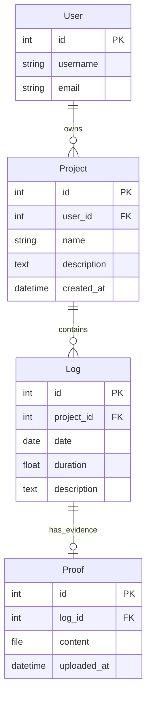

# ER Diagram for ProofLog

## Entities

### 1. User (Django Built-in)
| Attribute | Type | Constraints |
|-----------|------|-------------|
| id | Integer | PK, Auto Increment |
| username | String | Unique, Not Null |
| password | String | Not Null (Hashed) |
| email | String | Optional |

### 2. Project
| Attribute | Type | Constraints |
|-----------|------|-------------|
| id | Integer | PK, Auto Increment |
| user_id | Integer | FK -> User.id |
| name | String | Not Null |
| description | Text | Optional |
| created_at | DateTime | Auto Now Add |

### 3. Log
| Attribute | Type | Constraints |
|-----------|------|-------------|
| id | Integer | PK, Auto Increment |
| project_id | Integer | FK -> Project.id |
| date | Date | Not Null |
| duration | Float | Positive, Hrs |
| description | Text | Not Null |
| created_at | DateTime | Auto Now Add |

### 4. Proof
| Attribute | Type | Constraints |
|-----------|------|-------------|
| id | Integer | PK, Auto Increment |
| log_id | Integer | FK -> Log.id |
| file | FileField | Local Storage Path |
| uploaded_at | DateTime | Auto Now Add |

## Relationships

- **User** (1) ----< (N) **Project**
  - One User creates many Projects.
  - A Project belongs to exactly one User.

- **Project** (1) ----< (N) **Log**
  - One Project contains many Logs.
  - A Log belongs to exactly one Project.

- **Log** (1) ----< (0..1) **Proof**
  - One Log can have 0 or 1 Proof (Optional upload).
  - A Proof belongs to exactly one Log.

## Textual Diagram

