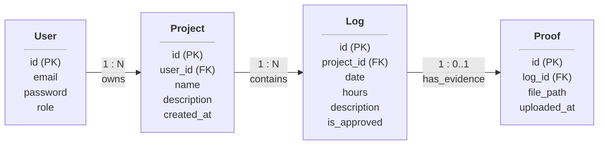

# Horizontal ER Diagram for ProofLog

This is a horizontal representation of the ProofLog Entity-Relationship (ER) diagram, structured from left to right for easier reading in landscape formats.

```mermaid
flowchart LR
    User["<b>User</b><hr>id (PK)<br>email<br>password<br>role"]
    Project["<b>Project</b><hr>id (PK)<br>user_id (FK)<br>name<br>description<br>created_at"]
    Log["<b>Log</b><hr>id (PK)<br>project_id (FK)<br>date<br>hours<br>description<br>is_approved"]
    Proof["<b>Proof</b><hr>id (PK)<br>log_id (FK)<br>file_path<br>uploaded_at"]

    User -- "1 : N<br>owns" --> Project
    Project -- "1 : N<br>contains" --> Log
    Log -- "1 : 0..1<br>has_evidence" --> Proof
```
