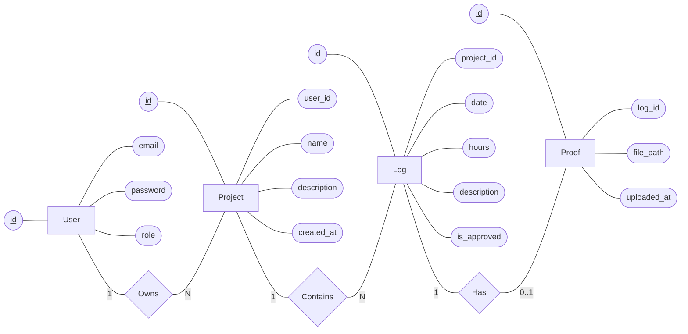

# Horizontal ER Diagram for ProofLog

This is a representation of the ProofLog Entity-Relationship (ER) diagram using standard ER notation: Rectangles for Entities (Tables), Diamonds for Relationships, and Ovals for Attributes (underlined for Primary Keys).

